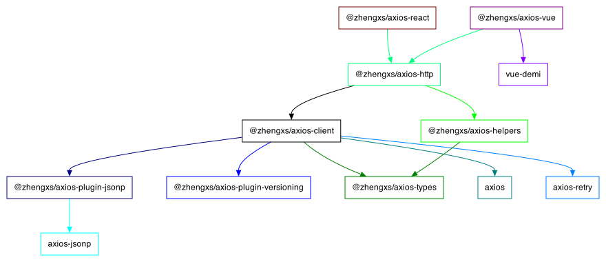

# @zhengxs/axios-http

> 模块尚未发布，正在积极开发中

> **注意**: 模块将作为 [VueExpress](https://github.com/zhengxs2018/vue-express) 一部分一起发布。

大多数前端应用都需要通过 HTTP 协议与后端服务器通讯，为约定和规范从 UI 交互到请求服务端数据的完整方案，进一步简化了应用的数据请求流程，基于 [Axios][axios] 提供了 HTTP 模块。

可以从 [这里](https://juejin.cn/post/7053471988752318472) 了解此模块的理念。

**依赖关系图**



- **@zhengxs/axios-http** 统一出口
- **@zhengxs/axios-client** Axios 的封装
- **@zhengxs/axios-helpers** 助手函数
- **@zhengxs/axios-plugin-\*** 功能插件 (`ps: 兼容 Axios 的实例`)
- **@zhengxs/axios-shared** 兼容层，用于解决依赖的模块方法未导出的问题
- **@zhengxs/axios-types** 提供给其他模块使用的 TS 类型

框架集成中

- **@zhengxs/axios-vue** 提供给 `Vue 2 & 3` 使用的插件，由 [vue-demi](https://github.com/vueuse/vue-demi) 提供技术支持

## 使用

### 安装依赖

```sh
# With NPM
$ npm install @zhengxs/axios-http --save

# With Yarn
$ yarn add @zhengxs/axios-http

# With PNPM
$ pnpm add @zhengxs/axios-http
```

### 示例

```js
import http from '@zhengxs/axios-http'

// 设置基础地址
http.setBaseURL('https://example.com')

// 设置自定义请求头
http.setHeader('x-api-version', 'v1')

// 设置 Authorization 头
// 默认为 Bearer 类型
http.setAuthorization('Bearer xxx')

// 设置 Authorization 头，自动加认证类型
// 默认为 Bearer 类型
http.setToken('xxx')

// 启用自动重试
http.enableAutoRetry()

// 发送请求
http.request('http://example.com/test')

// 发送 jsonp 请求
http.request('http://example.com/test', {
  jsonp: true // 设置 jsonp=true 可以将普通请求变为 jsonp
})
```

## 文档

您可以点击 [这里](https://zhengxs2018.github.io/axios-http/) 查看文档。

## 启动项目

本项目为 monorepo 架构，使用 [lerna](https://github.com/lerna/lerna) (`可选`) 进行管理，但默认配置的包管理器为 [yarn 1.x](https://classic.yarnpkg.com/lang/en/).

lerna 是可选的工具，但 yarn 必须全局安装。

```sh
# 安装依赖
$ yarn install

# 生成 .d.ts 文件
$ yarn build:dts

# 启动文档
$ yarn docs:dev

# 发布文档
$ yarn docs:release
```

## 注意

依赖关系图 使用 [package-dependency-graph](https://github.com/plantain-00/package-dependency-graph) 模块生成，因国内网络访问 github 问题，不再内置此模块，需要的可以使用 cnpm 进行全局安装。

## License

MIT

[axios]: https://axios-http.com/
[swr]: https://swr.vercel.app/
